<!-- ============================================================
  Profile README — lives in the repo FryFr/FryFr as README.md
  Companion files (path in the repo):
    · header.svg        → assets/header.svg
    · architecture.svg  → assets/architecture.svg
    · stats.svg         → assets/stats.svg  (placeholder — the action refreshes it)
    · generate_stats.py → scripts/generate_stats.py
    · stats.yml         → .github/workflows/stats.yml
    · snake.yml         → .github/workflows/snake.yml
  Only pending TODO: the Platica live-site link (search "TODO").
  TikTok badge is commented out — enable it when the account exists.
  If you ever rename your GitHub handle, find & replace "FryFr"
  in the activity-graph/snake URLs below.
============================================================ -->

<div align="center">



<a href="https://www.linkedin.com/in/jsilva-medina/"></a>
<a href="https://www.youtube.com/@zicamtech"></a>
<a href="https://portfolio-juan-silva-eight.vercel.app/en"></a>
<!-- TikTok badge pending: add it when the account exists -->
<!-- <a href="#"></a> -->

</div>

## $ whoami

```console
juan@bogota:~$ whoami
Mechatronics engineer · Bogotá, Colombia
Business Systems & AI Specialist @ industrial manufacturing (remote)

juan@bogota:~$ cat mission.txt
Automate everything — from a company's processes to my own life.
Robotics, AI and software. Built in public.
```

By day I design AI automations, self-hosted infrastructure and AI adoption programs for an industrial manufacturer. By night I build robots, physical AI assistants and products of my own. Next stop: a robotics & automation master's in Spain.

## $ cat architecture.txt

Four stacked layers that rarely live in the same engineer — the intersection is the whole point:

<div align="center">



</div>

## $ systemctl status projects

|     | Project | What it is | Stack | Signal |
|-----|---------|------------|-------|--------|
| 🟢 | **Platica** <!-- TODO: link to live site --> | WhatsApp bot comparing grocery prices **per unit** across Colombian chains | Python · TypeScript · PostgreSQL · OCR | 241,000+ price points · 8 chains · 4 cities |
| 🟢 | **[Milu](https://miluprana.com)** | Premium e-commerce for a physical product, built end-to-end | React 19 · Supabase · MercadoPago | live & selling · 84 unit + 24 E2E tests |
| 🟡 | **[Michibot](https://portfolio-juan-silva-eight.vercel.app/en/projects/michibot)** <!-- swap to repo link when public --> | Desktop robot with a conversational voice assistant, Spanish-first | FastAPI · ESP32-S3 · STT/LLM/TTS | first word in **< 900 ms** |
| 🔒 | [Logistics control tower](https://portfolio-juan-silva-eight.vercel.app/en/projects/dynapro-tracking) | AI reads dispatch emails, validates against the ERP, tracks every shipment | n8n · React · Firebase | replaced a 26-column manual spreadsheet |
| 🔒 | Commissions engine | Deterministic rules engine for sales commissions | Next.js · Supabase · n8n | replaced a manual Excel process |
| 🎓 | [6-DoF robotic arm](https://portfolio-juan-silva-eight.vercel.app/en/projects/robotic-arm) | SolidWorks → URDF → ROS → physical build | ROS · control theory | university flagship |

<div align="center">

`🟢 in production` · `🟡 building now` · `🔒 private (work)` · `🎓 university archive`

</div>

> The systems I build at work run behind closed doors — the engineering lessons don't. Incidents, postmortems and architecture decisions get shared in public.

## $ htop

<!-- Custom stats panel — generated daily with real API data by
     .github/workflows/stats.yml + scripts/generate_stats.py.
     No third-party card services (they rate-limit and break). -->

<div align="center">




<!-- Generated by .github/workflows/snake.yml — run the workflow once (Actions tab) before this renders -->
<picture>
  <source media="(prefers-color-scheme: dark)" srcset="https://raw.githubusercontent.com/FryFr/FryFr/output/snake-dark.svg">
  
</picture>

</div>

## $ ping juan

Open to interesting problems in AI automation and robotics. If you want your company's processes to run themselves — or just want to talk robots — reach out:

<div align="center">

<a href="https://www.linkedin.com/in/jsilva-medina/"></a>
<a href="https://wa.me/573161309551?text=Hola%20Juan%2C%20vi%20tu%20GitHub%20y%20quiero%20hablar%20de%20automatizaci%C3%B3n."></a>

</div>

---

<div align="center">

`[ STATUS: BUILDING IN PUBLIC — incidents and postmortems included ]`

</div>
